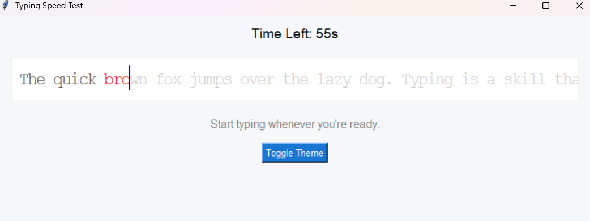

````markdown
## Typing Speed Test

A simple yet elegant **Typing Speed Test** desktop app built using Python and Tkinter.  
It helps users test and improve their typing speed, accuracy, and consistency.

---

###  Features

- Live typing feedback with correct/incorrect color highlights  
- Beep sound on typing mistakes  
- Toggle between **Dark Mode** and **Light Mode**  
- 60-second countdown timer  
- End results with WPM, CPM, and accuracy  
- Responsive UI with smooth typing experience  
- Real-time visual cursor and scrollable canvas  

---

### Screenshot

*(You can upload a screenshot on GitHub and link it here)*

```markdown

````

---

### Technologies Used

* Python 3
* Tkinter (for GUI)
* `playsound` (for beep on error)
* `threading` (non-blocking sound playback)

---

### How It Works

1. A reference paragraph appears on screen.
2. User starts typing — the timer begins automatically.
3. Mistyped characters play a short beep sound.
4. After 60 seconds, the app calculates:

   * **WPM (Words Per Minute)**
   * **CPM (Characters Per Minute)**
   * **Accuracy (%)**
5. User can toggle between dark/light themes and retry.

---

### File Structure

```bash
typing-speed-test/
├── beep.mp3           # Sound file for incorrect key press
├── typing_test.py     # Main Python script
├── requirements.txt   # Python package requirements
└── README.md          # This file
```

---

### Installation

Install the required Python packages using:

```bash
pip install -r requirements.txt
```

---

### Run the App

```bash
python typing_test.py
```

---

### Customization

* Change the `REFERENCE_TEXT` variable in the script to modify the typing content.
* Replace `beep.mp3` with any short sound file of your choice.

---

###  To-Do / Improvements

* Add difficulty levels (beginner, advanced)
* Track and save typing history
* Mobile version using Kivy or web version using Flask/React

---
```
